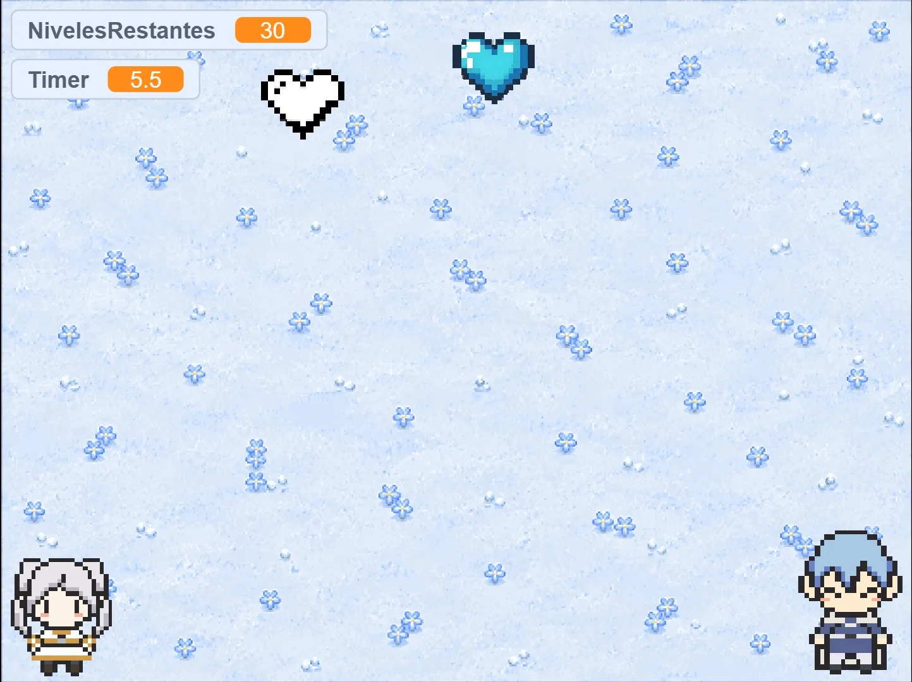
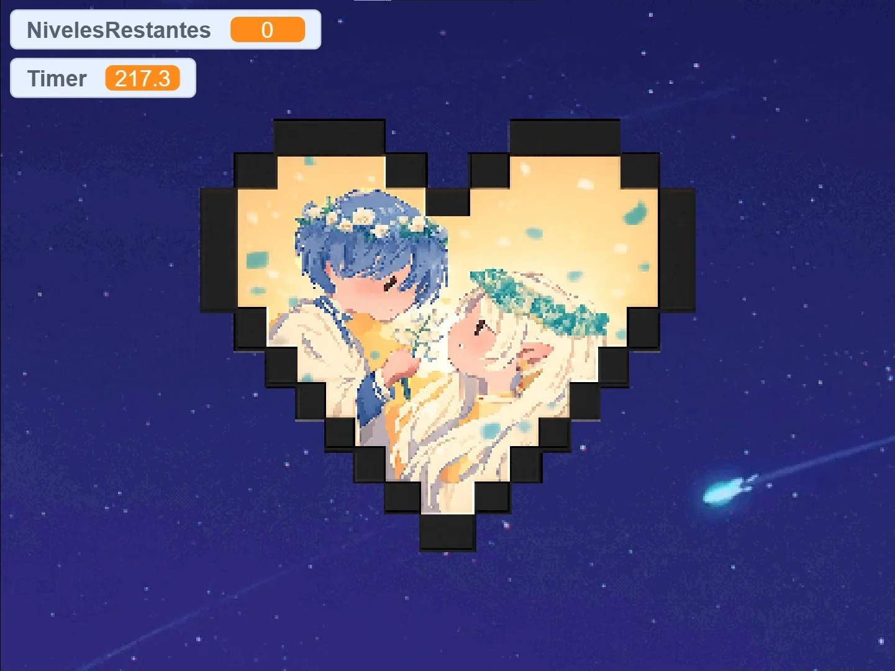

# Zwei Herzen 💙🤍

Juego cooperativo de 2 jugadores hecho en Scratch, inspirado en *Frieren: Beyond Journey's End*.

🎮 **[Jugar ahora](https://n4du.github.io/zwei-herzen)**

## Cómo se juega

Controlás a **Frieren** y **Himmel** al mismo tiempo, en el mismo teclado.

| Personaje | Controles |
|---|---|
| Frieren | `W` `A` `S` `D` |
| Himmel | `↑` `↓` `←` `→` |

Por el mapa se mueven dos corazones: uno blanco (Frieren) y uno azul (Himmel). Cada uno recolecta el que le corresponde y después se juntan, formando un corazón rojo.

Son 30 niveles. A medida que avanzás, los personajes van más lento y los corazones más rápido.

Al terminar el nivel 30, el corazón rojo crece y gira en el centro de la pantalla hasta dar paso a una animación final con lluvia de meteoritos.

## Tecnología

Hecho en **Scratch** y empaquetado como app web con [TurboWarp Packager](https://packager.turbowarp.org).

## Créditos

[Nahuel](https://github.com/N4DU) — inspirado en *Frieren: Beyond Journey's End*
