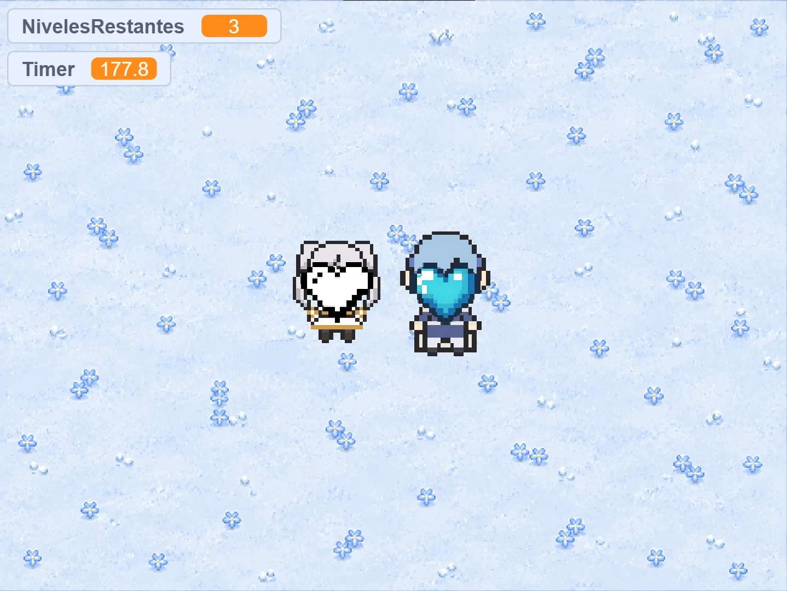

# Zwei Herzen 💙🤍

A 2-player cooperative game made in Scratch, inspired by *Frieren: Beyond Journey's End*.

🎮 **[Play now](https://n4du.github.io/zwei-herzen)**

## How to play

You control **Frieren** and **Himmel** at the same time, on the same keyboard.

| Character | Controls |
|---|---|
| Frieren | `W` `A` `S` `D` |
| Himmel | `↑` `↓` `←` `→` |

Two hearts move around the map: a white one (Frieren) and a blue one (Himmel). Each one collects the heart that belongs to them, then they meet up and the hearts combine into a single red one.

There are 30 levels. As you progress, the characters move slower and the hearts move faster.

After clearing level 30, the red heart grows and spins at the center of the screen, leading into a final animation with a meteor shower.

## Tech

Built in **Scratch** and packaged as a standalone web app with [TurboWarp Packager](https://packager.turbowarp.org).

## Credits

[N4DU](https://github.com/N4DU) — inspired by *Frieren: Beyond Journey's End*
